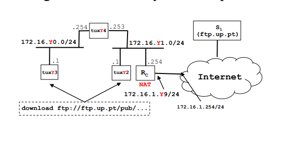

# Guia para a demonstração do 2º trabalho prático de RC
- Y -> número da bancada
## Configuração Inicial & Switch/Bridges
- Em primeiro lugar,  executar ```systemctl restart configuration``` em todos os tuxs para resetar configurações prévias das interfaces e das routes
- Após isso, em qualquer tux (escolhemos o tux3), conectar o cabo que liga a porta série do tux3, à consola do switch (cabos fazem crossover).
- Ligar o gtkterm, com baudrate de 115200, para aceder à consola do switch
- Fazer login, e após isso correr o comando ```/system reset-configuration``` para resetar qualquer configuração
- Criar duas bridges Y0 e Y1 usando o comando ```/interface bridge add name=bridgeY0```
- Remover 5 portas do switch ```/interface bridge port remove [find interface =ether1]```
- Alocar 2 dessas para a bridge Y0 e as restates 3 para a bridge Y1, usando comandos do tipo ``` /interface bridge port add bridge=bridgeY0 interface=ether1```.
- As bridges por si só funcionam como isoladoras entre portas do switch, quando queremos por exemplo que alguns dispositivos que estão ligados ao switch não comuniquem entre si.



## Ifconfigs
- No tux 3:
```console
> ifconfig eth0 up
> ifconfig eth0 172.16.y0.1/24
> ifconfig eth0 
```
- No tux 4:
```console
> ifconfig eth0 up
> ifconfig eth0 172.16.y0.254/24
> ifconfig eth0 

> ifconfig eth1 up
> ifconfig eth1 172.16.y1.253/24
> ifconfig eth1 
```
- No tux 2:
```
> ifconfig eth0 up
> ifconfig eth0 172.16.y1.1/24
> ifconfig eth0 
```
## Routes

### No tux 3:
```console
route add -net 172.16.y1.0/24 gw 172.16.y0.254
```
- Isto permite ao tux 3 usar o ip da interface do tux 4 que está na mesma bridge como gateway para enviar pacotes para endereços do tipo 172.16.y1.0/24
### No tux 2: 
```console
route add -net 172.16.y0.0/24 gw 172.16.y1.253
```
- Isto permite ao tux 2 usar o ip da interface do tux 4 que está na mesma bridge como gateway para enviar pacotes para endereços do tipo 172.16.y0.0/24

## Tornar o tux 4 num router
- No tux 4, correr o comando ```echo 1 > /proc/sys/net/ipv4/ip_forward```
- Isto permite ao tux 4 encaminhar pacotes que não são para ele, para o tux 3 ou tux 2, dependendo do destino do pacote.
- No tux 4, correr o comando ```echo 0 > /proc/sys/net/ipv4/conf/eth0/send_redirects```
- Isto faz com que o tux 4 não envie pacotes ICMP de redirect para o tux 3 ou tux 2, quando recebe pacotes que não são para ele, mas que o tux 3 ou tux 2 podem encaminhar para o destino correto.

## Router comercial
- Retirar o cabo ethernet da consola do switch, e ligar esse mesmo cabo à consola do router mikrotik.
- Fazer login no router, e dar restart à configuração ```/system reset-configuration```
- Conectar a porta ether1 do router à porta PY.1, da rede do laboratório.
- Conectar a porta ether2 do router a uma porta alocada na bride Y1.
- Na consola do router configurar os ip's, seguindo o esquema da foto acima.
```console
/ip address add address=172.16.1.Y9/24 interface=ether1
/ip address add address=172.16.21.254/24 interface=ether2
```
## Routes adicionais
### No tux 3 adicionar esta rota:
```console
route add default gw 172.16.y0.254
```
- Isto significa que o tux 4 passa a ser o router default para o tux 3.
### No tux 2 e no tux 4 adicionar esta rota:
```console
route add default gw 172.16.y1.254
```
- Isto significa que o router comercial passa a ser o router default para o tux 2 e tux 4, que trata de endereços desconhecidos para estes tux.
### Na consola do router adicionar estas rotas:
```console
/ip route add dst-address=172.16.y0.0/24 gateway=172.16.y1.253
/ip route add dst-address=0.0.0.0/0 gateway=172.16.1.254
```
- Isto significa que o router comercial da bancada encaminha pacotes para o tux 3 usando a interface eth1 do tux 4 como gw, e que o router comercial da bancada tem como rota default o router da sala.

## NAT
- Verificar que a funcionalidade NAT no router se encontra ativa
- O NAT está responsável por traduzir os endereços privados de uma rede local, para um endereço público que é único. Isto permite que os tuxs comuniquem com a internet.

## DNS
- Em todos os tux devemos configurar o servidor de DNS, no ficheiro  ```/etc/resolv.conf```
- O servidor de DNS que vamos usar é o services.netlab.fe.up.pt (172.16.1.1)
- O principal propósito do servidor de DNS é traduzir nomes de domínio legíveis por humanos (como www.exemplo.com) em endereços IP numéricos (como 192.0.2.1) que os computadores usam para se comunicar entre si.

## Nota adicional
- Aquando a transferência, é possivel desligar os cabos, pois o protocolo, usa uma forma de acks e nacks, com restransmissões, por isso é que é possível desligar os cabos e ligar novamente, sem que haja perda de dados.